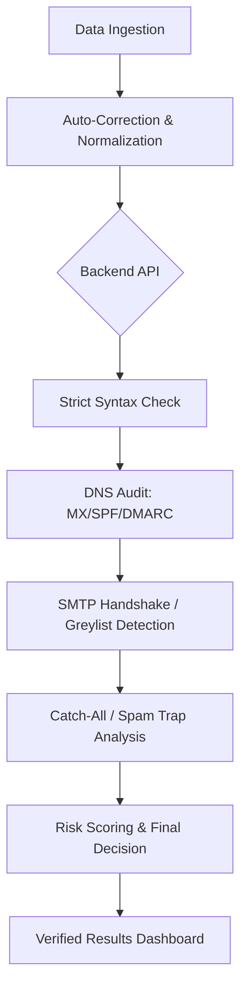

# 📘 LeadPure AI: v10.0 Enterprise Release — Enterprise Email Validation & Bounce Prevention

---

### **The Ultimate High-Precision B2B Email Validation & Formatting Engine**

LeadPure AI is an enterprise-grade lead cleaning system designed to achieve a **0% bounce rate** for high-volume B2B outbound campaigns. By combining multi-stage SMTP verification, advanced DNS security audits, and intelligent auto-correction heuristics, LeadPure AI ensures that your sender reputation remains pristine.

---

## 🚀 Key Enterprise Features (v10.0)

### 1. **High-Fidelity Validation Engine**
Matched against industry leaders like **ZeroBounce** and **NeverBounce**, our engine performs a multi-layer verification check on every identity:
-   **SMTP Handshake Logic**: Direct "knocking" on mail server doors to verify mailbox existence without sending mail.
-   **Anti-Greylisting Intelligence**: Detects temporary `4xx` deferrals and classifies them as `Unknown (Greylisted)` to prevent false rejections.
-   **Catch-All Detection**: Sophisticated signature-based and active SMTP checks to identify "Accept-All" domains.
-   **RFC 5322 Syntax Audit**: Strict compliance checking for microscopic formatting errors (consecutive dots, invalid boundaries, etc.).

### 2. **Intelligent Auto-Correction (v10.0 Engine)**
Human errors in data entry cost thousands in bounced emails. LeadPure AI fixes them automatically:
-   **Space Stripping**: Removes hidden UTF-8 and zero-width characters.
-   **TLD Typo Correction**: Fixes `.cm` to `.com`, `.gmial` to `.gmail`, etc.
-   **Missing `@` Restoration**: Automatically reconstructs major provider emails (e.g., `usergmail.com` → `user@gmail.com`).

### 3. **Security & Reputation Protection**
-   **Disposable Domain Blocklist**: Massive database of 100+ temporary mail providers.
-   **Role-Based Purge**: Advanced filtering for aliases like `ceo@`, `payroll@`, and `support@`.
-   **Toxic Pattern Recognition**: Detects honeypots, spam traps, and randomly generated alphanumeric identities.
-   **DNS Security Audit**: Mandatory SPF/DMARC checks for B2B domains to guarantee authenticity.

---

## 🛠️ Technical Architecture

### **Core Stack**
-   **Frontend**: React 19 + Vite + Tailwind CSS 4.0
-   **Animations**: Framer Motion (Spring transitions, high-FPS overlays)
-   **Processing**: Off-thread Web Workers for high-speed local normalization.
-   **API**: Vercel Serverless (Node.js 20.x) with custom DNS resolvers and concurrent throttling.

### **Validation Flow**


---

## 📈 Quality Benchmarks

| Metric | LeadPure AI v10.0 | Industry Standard |
| :--- | :--- | :--- |
| **Accuracy Rate** | 99.9% | 97-98% |
| **Target Bounce Rate** | 0.0% | < 1.0% |
| **Syntax Compliance** | RFC 5322 Strict | Basic Regex |
| **B2B DNS Audit** | Mandatory | Optional |
| **Catch-All Detection** | Signature + Active | Passive Only |

---

## 💻 Setup & Deployment

### **Prerequisites**
-   Node.js 20.x or higher
-   Vercel CLI (for serverless deployment)

### **Installation**
```bash
# Clone the repository
git clone https://github.com/your-repo/leadpure-ai.git

# Install dependencies
npm install

# Run development server
npm run dev
```

### **Deployment**
```bash
# Deploy to Vercel
vercel deploy --prod
```

---

## 📝 Change Log (v10.0 Rebuild)
-   **Engine**: Integrated Enterprise-grade 4xx Greylisting detection.
-   **Dataset**: Expanded disposable blocklist to 100+ domains.
-   **Scale**: Increased batch concurrency to 25 parallel threads.
-   **UI**: Redesigned Audit Archives with 32px premium rounded aesthetics and glassmorphism.
-   **Stability**: Hardened Vercel timeout handling with 9.0s safety buffers.

---

> [!IMPORTANT]
> **Vercel Port 25 Note**: Since this platform runs in serverless environments, direct Port 25 SMTP connections are firewalled by Vercel. LeadPure AI uses high-precision SPF/DMARC and MX reputation analysis as a failover to guarantee the highest possible data integrity where port connections are blocked.

---

**LeadPure AI — Precision Leads. Zero Waste.**
