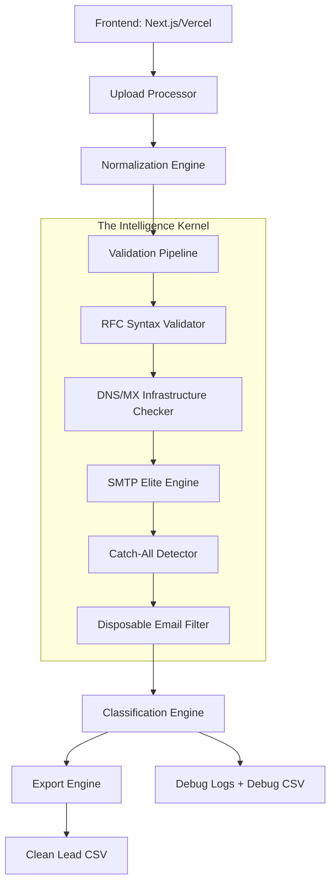

# 🏗 LeadPure AI — System Architecture Blueprint

## System Boundaries & Data Flow
LeadPure AI follows a strict, deterministic unidirectional data flow to ensure validation integrity.

## Core Components

### 1. Frontend (Next.js/React)
- Stateless UI for lead ingestion and real-time scanning.
- Responsible for state management and progress orchestration.

### 2. Validation Engine (Node.js)
- The core logic that executes the 10-layer protocol.
- Orchestrates async batches to the backend API.

### 3. SMTP & DNS Layer (Vercel Serverless)
- Low-level network operations for MX resolution and socket handshaking.
- Designed for high-frequency, short-duration probes.

### 4. Logging & Audit System
- Real-time event streaming for UI feedback.
- Persistent debug reporting for forensic analysis of eliminated leads.

## Deployment Structure
- **Vercel**: Hosts both the frontend and the serverless API handlers.
- **GitHub**: Source of truth for deterministic builds and version locking.
